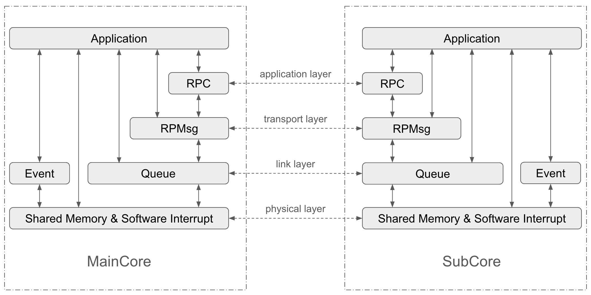

# ESP-AMP

## Introduction

ESP-AMP is an open source framework for building Asymmetric Multiprocessing (AMP) applications on ESP32 Sytem-on-a-Chips (SoC) with multiple processing cores. With one core running IDF FreeRTOS firmware, ESP-AMP facilitates another core to run a different software environment, such as bare-metal or any other RTOS environment. ESP-AMP also provides a set of APIs for inter-core communication and synchronization. In the rest of the README, We refer to the core running IDF FreeRTOS as maincore, and the core running other software environment as subcore.

Compared to the default Symmetric Multiprocessing (SMP) system offered by ESP-IDF, ESP-AMP has the following advantages:
- Leverage of LP Core: In SoCs with single High-Performance (HP) core, Low-Power (LP) Core can be used as subcore to offload some tasks from the maincore.
- Flexibility: ESP-AMP allows you to deploy different configurations and run dedicated applications in parallel on two cores to fit more complicated use cases. At present, only bare-metal is supported on subcore.
- Proprietary Consideration: Maincore can run proprietary software for certification and security, while subcore is free to execute open source firmware.

## Architecture

ESP-AMP offers a comprehensive set of components for inter-core communication (IPC) and synchronization, organized in a layered architecture as illustrated in the figure below. Each layer provides its own set of APIs, where higher-level APIs build upon lower-level ones. This design allows users the flexibility to select only the APIs they need: they can either use a subset of APIs from a single layer or combine APIs from different layers based on their specific use case, streamlining the application development process.



From bottom to top, these components are:

* Shared Memory: basic building block for cross-core communication. Refer to [Shared Memory Doc](./docs/shared_memory.md) for more details.
* Software Interrupt: inter-processor interrupt to notify a communicating core when certain message arrives. Refer to [Software Interrupt Doc](./docs/software_interrupt.md) for more details.
* Event: containing APIs for synchronization between maincore and subcore. Refer to [Event Doc](./docs/event.md) for more details.
* Queue: a bidirectional queue which enables core-to-core communication. Refer to [Queue Doc](./docs/queue.md) for more details.
* RPMsg: an implementation of Remote Processor Messaging (RPMsg) protocol that enables concurrent communication streams in application. Refer to [RPMsg Doc](./docs/rpmsg.md) for more details.
* RPC: a simple RPC framework built on top of RPMsg. Refer to [RPC Doc](./docs/rpc.md) for more details.

Apart from the IPC components, ESP-AMP comes with a build system that makes it easy and flexible to build firmware for both the maincore and the subcore. The build system features:

* Standard ESP-IDF build system to build maincore firmware.
* Two modes for building subcore firmware: unified build mode, which lets you build both the subcore and main core firmware with a single command, and separate build mode, where the subcore firmware is built independently.
* Two options to store subcore firmware: either embedding subcore firmware into maincore firmware or writing it to a flash partition.
* Dedicated toolchain settings for building subcore in bare-metal environment.

Please check [Build System Doc](./docs/build_system.md) for more details.


## Supported ESP-IDF Version and SoCs

For project development with ESP-AMP, it is recommended to use IDF v5.3.1. At present, the following SoCs are supported:

| SoC | Maincore | Subcore |
| :--- | :--- | :--- |
| ESP32-C6 | HP core | LP core |
| ESP32-P4 | HP core | HP core |


## Getting Started

For quick start, follow the steps below to build and run examples.

First, setup the IDF environment. 

``` shell
git clone --recursive https://github.com/espressif/esp-idf.git
cd esp-idf
git checkout v5.3.1
./install.sh
. export.sh
```

For more details of building projects using IDF, please refer to [IDF Programming Guide](https://docs.espressif.com/projects/esp-idf/en/latest/esp32/get-started/index.html)

Second, clone this repository.
``` shell
git clone https://github.com/espressif/esp-amp.git
```

Now you can process to any example folders and follow README.md there to build the example.

``` shell
cd esp-amp/examples/<example>
idf.py set-target <target>
idf.py build
idf.py flash monitor
```

Console log will be printed on HP-UART and can be viewed via serial monitor. For ESP32-P4, both maincore and subcore log are printed to HP-UART by default. For ESP32-C6, only maincore log is printed. To view subcore log, you can either use a serial-to-usb cable and connect its RX pin with GPIO5 on ESP32-C6, or set `CONFIG_ULP_HP_UART_CONSOLE_PRINT=y` to route LP core console log to HP-UART. The subcore output can be interleaved with logs from maincore on ESP32-C6 if LP core console log is redirected to HP-UART. For more details, please refer to ESP32-C6 related limitations [here](#known-limitations).

## Tips for developing subcore firmware

The following tips work for both ESP32-P4 and ESP32-C6:

* Stay with static memory allocation: Subcore firmware does not support dynamic memory allocation. Heap section is not specified in linker script and the entire space above `.bss` section is reserved for stack. Calling malloc() will always fail.
* Reserve enough stack space. Stack is allocated from LP RAM on ESP32-C6 and HP RAM on ESP32-P4. In ESP-AMP, stack space starts from the end of `.bss` section. Stack smashing protection mechanism is not supported on subcore. When the stack grows, it may overwrite `.bss` section without any warning and cause unpredictable results. Therefore, it is recommended to reserve enough stack space for subcore application. Sdkconfig option `ESP_AMP_SUBCORE_STACK_SIZE_MIN` can be used to specify the minimum stack size. If the remaining memory space is insufficient to allocate the stack, the build will fail.

If you are developing subcore firmware for ESP32-C6, please refer to the following tips:

* Go beyond the limited RTC Memory: By default, subcore firmware is loaded into RTC memory if subcore type is LP core. However, the limited size of RTC RAM (16KB on ESP32-C6) can quickly go short as LP core firmware grows. To solve the problem, set `CONFIG_ESP_AMP_SUBCORE_USE_HP_MEM=y` to load subcore firmware into HP RAM. Please refer to [Memory Layout Doc](./docs/memory_layout.md) for more details.
* Keep away from HP ROM APIs: LP core has no access to HP ROM. Therefore, ROM apis such as `esp_rom_printf`, `esp_rom_delay_us` are not supported on LP core.

## Known Limitations

ESP-AMP is still under active development. The following limitations exist at present:

### ESP32-P4 Related

* Subcore Type: At present only HP core is supported as subcore on ESP32-P4. LP core is not yet supported.
* Missing support for XIP and PSRAM: Cache is not enabled on subcore at present. As a consequence, accessing data from PSRAM and execution in Place (XIP) from flash are not supported.
* Limited Cache Size on ESP32-P4 Maincore: ESP32-P4 SoC encapsulates 768 KB Internal L2MEM, from which cache memory is allocated. Users can configure 128KB, 256KB or 512KB as cache memory via sdkconfig `CONFIG_CACHE_L2_CACHE_SIZE`. However, due to the 256KB reserved L2MEM for subcore firmware, the maximum size of cache memory with ESP-AMP enabled is reduced to 256KB.

### ESP32-C6 Related

* Output interleaving between maincore and subcore: By default, console log of LP core uart outputs via LP-UART TX pin, which is different from HP-UART TX pin used by maincore application. By enabling `CONFIG_ULP_HP_UART_CONSOLE_PRINT`, LP core console log can be routed to HP-UART TX pin. This allows you to easily view the output of subcore application without having to connect to LP-UART. However, the lack of mutual exclusion between HP core and LP core will cause the output from maincore and subcore to be interleaved. Meanwhile, HP-UART is clock gated or powered down when HP core is in deep sleep. Due to these limitations, it is suggested to use LP-UART for subcore application console output.

## FAQ

### Why not use OpenAMP?

[OpenAMP](https://github.com/OpenAMP/open-amp) is a popular open source framework for building AMP applications on SoCs with multiple processing cores. In fact, ESP-AMP is inspired by OpenAMP. The main reason that we create OpenAMP instead of reusing OpenAMP is the need of an AMP framework with small footprint. Abundant features in OpenAMP not only increase the complexity for use, but also lead to bloating code size. This makes OpenAMP difficult to port to systems with limited resources, especially ESP32C6 with only 16KB RTC RAM as default internal RAM of LP core. In contrast, ESP-AMP is designed to be lightweight and efficient.

### Can RTCRAM be used as shared memory?

It is not recommended to use RTCRAM as shared memory since atomic operation is not supported. CAS operations will fail if the atomic data resides in RTCRAM.

### How to develop peripheral drivers for subcore?

For HP peripherals, ESP-IDF hal component contains low-level drivers which provides an OS-agnostic and consistent set of APIs which can be used in any environment to manipulate HP peripheral registers among different SoCs. For LP peripherals, ESP-IDF ulp component has already implemented ready-to-use drivers. Please refer to [peripheral](./docs/peripheral.md) for more details.

### Is floating-point supported on subcore?

ESP32-P4 HP core supports the RISC-V standard Single-Precision Floating-Point instruction set extension. This enables hardware FPU acceleration for floating-point arithmetic, providing a significant performance boost for applications that rely heavily on floating-point operations. ESP-AMP enables this feature by default when the ESP32-P4 HP core is selected as the subcore. However, this feature comes with trade-offs, particularly in terms of context switch overhead. Hardware-based floating-point operations require saving and restoring additional registers, which can increase the time needed for context switching. This overhead can impact ISR handling speed and compromise the system's real-time performance. ESP-AMP offers the flexibility to whether enable hardware FPU in ISRs or not. By default, it is disabled to achieve better real-time performance, and any attempt to execute floating-point instructions in an ISR will result in an illegal instruction exception. If you decide to enable hardware-based floating-point operations in ISRs, set `CONFIG_ESP_AMP_SUBCORE_ENABLE_HW_FPU_IN_ISR=y` in the sdkconfig.

The LP core lacks a hardware FPU, so any floating-point operations are executed purely in software using the built-in libc provided by the compiler (in the case of ESP-AMP, this is newlib-nano). This software-based approach significantly increases code size and adds computational overhead. Consequently, it is strongly recommended to use integer operations exclusively when the LP core is selected as the subcore.

**NOTE**: Printing floating-point numbers to the console is not supported by either HP or LP subcore.
