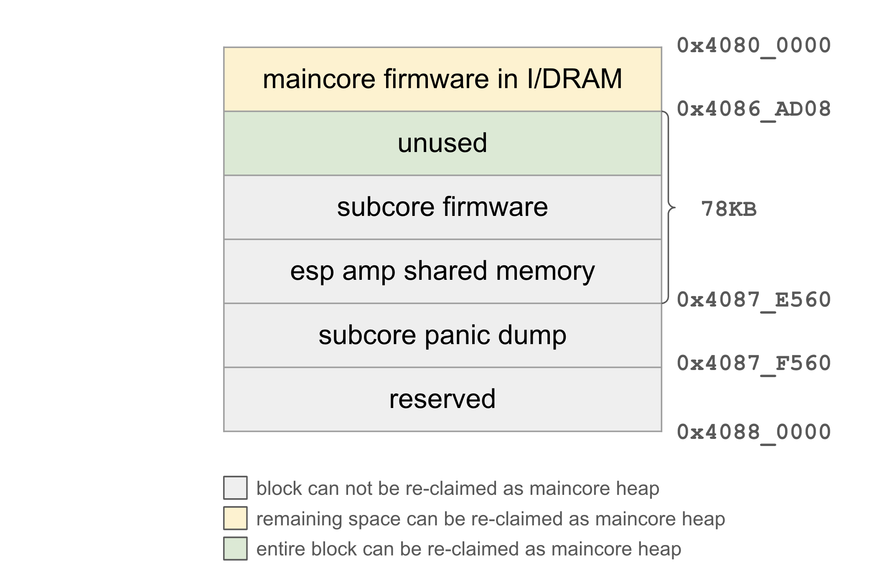
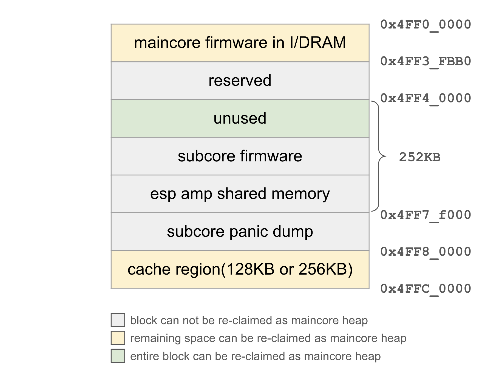

# Memory Layout of DRAM

This document describes the internal DRAM memory layout of ESP-AMP projects.

## Overview

ESP-AMP splits internal DRAM into different sections, including a maincore firmware region to load maincore firmware, a shared memory region for cross-core communication, and a subcore firmware region to load subcore firmware. A good understanding of the memory layout is helpful to develop more efficient AMP applications.

## Design

### Memory Layout

ESP-AMP project splits internal DRAM into several regions:
* Maincore I/DRAM: maincore firmware specified as IRAM/DRAM attribute.
* Maincore heap: maincore heap region. DRAM space except reserved region, such as subcore firmware, ROM data and cache region, can be allocated as maincore heap.
* Bootloader firmware: 2nd bootloader for loading maincore firmware into HP RAM. This region can be released and added to maincore heap region after maincore firmware is loaded into HP RAM.
* ROM data: ROM .data/.bss section. This region cannot be released.
* Subcore firmware: the entire subcore firmware since XIP is not supported at present. This region is reserved by `SOC_RESERVE_MEMORY_REGION`.
* Shared memory region: shared memory accessible by both maincore and subcore. This region is also reserved by `SOC_RESERVE_MEMORY_REGION`.
* Flash/psram cache region: cache memory for flash/psram. This region is allocated from the DRAM.

The following diagram shows the memory layout of ESP32-C6 DRAM with LP subcore firmware loaded into DRAM.

The configurable cache size of ESP32-P4 leads to a different memory layout from ESP32-C6. In normal IDF projects, ESP32-P4 cache can be configured as 128KB (0x4FFA_0000 ~ 0x4FFC_0000), 256KB (0x4FF8_0000 ~ 0x4FFC_0000) or 512KB (0x4FF6_0000 ~ 0x4FFC_0000). In ESP-AMP, only the first two options are supported. The remaining 256KB DRAM (0x4FF4_0000 ~ 0x4FF8_0000) is reserved for subcore firmware and shared memory. Address space is allocated from 0x4FF8_0000 down, and the remaining space will be given back to maincore heap.

The following diagram shows the memory layout of ESP32-P4 DRAM with HP subcore firmware loaded into DRAM.

### Shared Memory Region

Shared memory is allocated from DRAM (HP MEM). Although RTC RAM (LP MEM) is also accessible by both HP core and LP core, atomic operation is not supported by RTC RAM. Consistency of shared memory cannot be guaranteed in this case.

Since AMP component allocate their data from shared memory, especially for queue component which needs considerable size of shared memory as ring buffer, it is recommended to reserve sufficient amount of shared memory.

### Subcore Firmware Region

If subcore is LP core, subcore firmware can be loaded entirely into RTC RAM. However, the 16KB size of RTC RAM can quickly go short as LP core firmware grows. Meanwhile, some features such as [deep sleep wake stubs](https://docs.espressif.com/projects/esp-idf/en/v5.3.1/esp32c6/api-guides/deep-sleep-stub.html) and [ESP Insights](https://insights.espressif.com/) also consume RTC RAM, which further limits the capability of RTC RAM to hold subcore firmware.

To solve the problem, set `CONFIG_ESP_AMP_SUBCORE_USE_HP_MEM=y` to load subcore firmware into HP RAM. Size of memory can be configured via `CONFIG_ESP_AMP_SUBCORE_USE_HP_MEM_SIZE`. For ESP32-C6, the maximum size is 48KB. For ESP32-P4, the maximum size is 192KB.

## Usage

### How to avoid data race and ensure consistency

Proper synchronization is necessary to avoid conflicts when shared memory is accessed by maincore and subcore simultaneously. The consistency of shared memory is ensured by the following rules:

1. Allocating and writing to shared memory must be completed by maincore before subcore is booted. After subcore starts to run, maincore and subcore can only read data from SysInfo. Since there is no simultaneous read and write access to shared memory via SysInfo, the consistency of shared memory is guaranteed.
2. Event bits and software interrupt bits in shared memory are atomic integers. Any read and write access are implemented as atomic operations.
3. The synchronization of queue is guaranteed by single-writer-single-reader circular buffering. For more details, please refer to OpenAMP's [RPMsg specification](https://openamp.readthedocs.io/en/latest/protocol_details/rpmsg.html).

### Sdkconfig Options

* `CONFIG_ESP_AMP_SUBCORE_USE_HP_MEM`: If subcore firmware cannot fit into RTCRAM, part of DRAM can be reserved for subcore to load and run its firmware in DRAM.
* `CONFIG_ESP_AMP_SUBCORE_USE_HP_MEM_SIZE`: This specifies the size of DRAM used for subcore firmware.

## Application Examples

* [subcore_use_hp_ram](../examples/subcore_use_hp_ram): demonstrates how to load subcore firmware into HP RAM.
