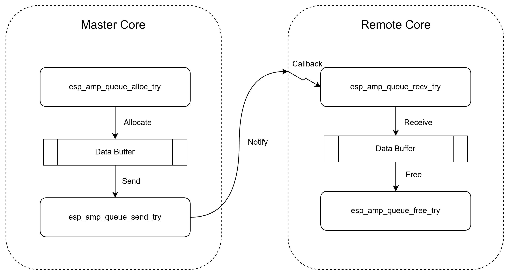
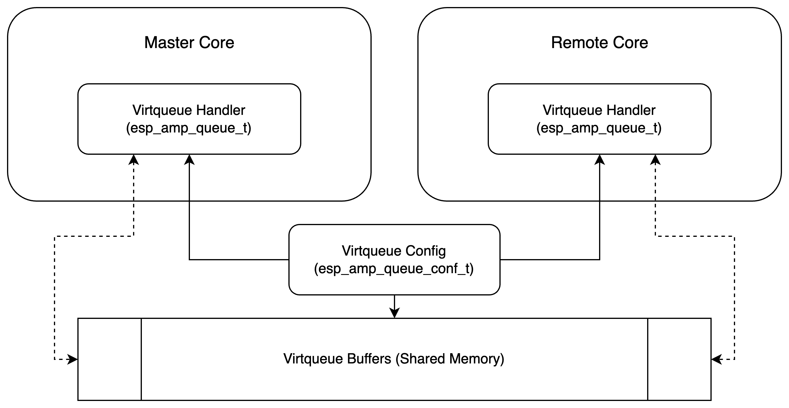

# Virtqueue (Link Layer)

## Overview
The Link layer utilizing `Virtqueue` is the core part of the whole RPMsg framework used for communication and data exchange, which is implemented in `src/queue/esp_amp_queue.c`. Originally used in `VirtIO`, `Virtqueue` provides a mechanism for efficient core-to-core communication without the need for inter-core synchronization (neither mutex nor atomic instruction), which is achieved by a special data structure called `Vring`, enabling multiple asynchronous contexts to interchange data between two cores simultaneously.

## Design

### Concept and Role

`Vring` is composed of three basic parts - buffer descriptor pool, available(input) ring buffer, and used(free) ring buffer, which are all physically stored in the allocated shared memory region. However, the real data buffers which stores data for communication/exchange all lie on another shared memory regions which are allocated during initialization using **ESP-AMP Sysinfo** APIs as well if RPMsg is used.

The `Vring` component **stores only necessary information for tracing and controlling** those data buffers, thus having a low performance overhead and memory footprint. Briefly speaking, **buffer descriptor pool** record all **pointers** to real data buffers, while **available(input) ring buffer** and **used(free) ring buffer** indicate which of them are available/used.

Technically, `Virtqueue` has two main varieties which are mostly functionally equivalent, one is called `Split Virtqueue`, the other is called `Packed Virtqueue`. Unlike most similar RPMsg frameworks which adopt the standard `Split Virtqueue`, the latter one is chosen and implemented in our case, which leads to even higher performance and lower footprint compared to other implementations.

Typically, a `Virtqueue` has one side called `master core` and the other side called `remote core`. `master core` can "recycle" `used(free)` buffers, read/write to them, and then mark them as `available`. Once the buffer is marked as `available`, it is treated as sent to the `remote core`, thus, only `remote core` can read/write to them now. Similarly, after "consuming" the `available` buffer, `remote core` can mark it as `used(free)` again, which sends the buffer back to the `master core`.



The following section as well as the figure shown above describes this procedure and explains its corresponding APIs in details with what they are actually doing when being invoked:

```c
int esp_amp_queue_alloc_try(esp_amp_queue_t *queue, void** buffer, uint16_t size);
```

Called only by `master core`. This API will reserve one `available` buffer entry internally from the current `Virtqueue`. Once the API returns a valid pointer, read/write to the buffer can be performed in place, which can be then sent to the `remote core` later.

```c
int esp_amp_queue_send_try(esp_amp_queue_t *queue, void* buffer, uint16_t size);
```

Called only by `master core`. This API will mark the previously reserved `available` buffer entry as `used(free)`, which means that this buffer has been sent to the `remote core` and **can not** be read/written by `master core` anymore from now on.

```c
int esp_amp_queue_recv_try(esp_amp_queue_t *queue, void** buffer, uint16_t* size);
```

Called only by `remote core`. This API will reserve one `used(free)` buffer entry internally from the current `Virtqueue`. Once the API returns a valid pointer, read/write to the buffer can be performed in place, which can be then sent back to the `master core` later.

```c
int esp_amp_queue_free_try(esp_amp_queue_t *queue, void* buffer);
```

Called only by `remote core`. This API will mark the previously reserved `used(free)` buffer entry as `available`, which means that this buffer has been sent back to the `master core` and **can not** be read/written by `remote core` anymore from now on.

However, using RPMsg(Transport Layer)'s APIs is still highly recommended. Unless you do have certain requirements which can't be satisfied.

**Note: The `Virtqueue` implementation in the framework DOESN'T COMPLETELY follow the standard. DO NOT implicitly assume any features in other `Virtqueue` implementations except for those explicitly documented**

### Data Structure

The relationship of `esp_amp_queue_conf_t`, `esp_amp_queue_t`, and virtqueue buffers is depicted in the following figure:



Typically, these data structures should be initialized using the corresponding APIs before use, which will be explained in the next **Usage** section.

## Usage
The usage of APIs is exactly the same between main-core and sub-core.

### Role
As depicted in the **Design** section above, one of cores using `Virtqueue` is defined as `master core`, the other one is defined as `remote core`. Typically, `master core` can proactively send the message, while `remote core` should read/consume the message from `master core` and then free the message buffer which can be re-used by the `master core` later. Both main-core and sub-core can be either `master core` or `remote core` when communicating using a single `Virtqueue`. 

### Initialization

To initialize a virtqueue, two areas(buffers) should be created and initialized which can be accessed by both `master core` and `remote core`:

1. queue descriptor
2. queue buffer pool

```c
int esp_amp_queue_init_buffer(esp_amp_queue_conf_t* queue_conf, uint16_t queue_len, uint16_t queue_item_size, esp_amp_queue_desc_t* queue_desc, void* queue_buffer);
```

This API can be used to initialize these two areas. It is sufficient to invoke it once on either `master core` or `remote core`. The API requires one `esp_amp_queue_conf_t` struct to be passed, which will be filled and used to create the virtqueue handler (`esp_amp_queue_t`) subsequently.

After creating and initializing queue buffers, the following API should be called on both `master core` and `remote core` to create the queue handler (`esp_amp_queue_t`) associated with the corresponding `esp_amp_queue_conf_t` struct:

```c
int esp_amp_queue_create(esp_amp_queue_t* queue, esp_amp_queue_conf_t* queue_conf, esp_amp_queue_cb_t cb_func, esp_amp_queue_cb_t ntf_func, void* priv_data, bool is_master);
```

When creating the virtqueue handler (`esp_amp_queue_t`), three extra parameters should be specified: **callback function, notify function, and the role** (whether to be a `master core` or `remote core`). For **callback function and notify funtion**, passing `NULL` as the parameter if it is currently not required.

### Callback and Notify
**callback function** should be invoked either by polling mannually or registering for being triggered automatically under ISR context. **notify function** will be automatically called whenever `esp_amp_queue_send_try` is invoked and successful.

Here is the definition of function pointer type for both **callback function** and **notify function**:

```c
typedef int (*esp_amp_queue_cb_t)(void*);
```

Basically, **callback function** is responsible for receiving and processing new data from the other side, while **notify function** is responsible for notifying the other side when successfully sending the data item.

### Send and Receive
There are mainly 4 APIs used to send/receive the data through the virtqueue:

```c
int esp_amp_queue_alloc_try(esp_amp_queue_t *queue, void** buffer, uint16_t size);
```

`master core` only, allocate a data buffer which can be sent later

```c
int esp_amp_queue_send_try(esp_amp_queue_t *queue, void* buffer, uint16_t size);
```

`master core` only, send an allocated data buffer to the `remote core`

```c
int esp_amp_queue_recv_try(esp_amp_queue_t *queue, void** buffer, uint16_t* size);
```

`remote core` only, receive a data buffer from `master core`

```c
int esp_amp_queue_free_try(esp_amp_queue_t *queue, void* buffer);
```

`remote core` only, free the data buffer received from `master core`

The typical workflow of virtqueue for our implementation is shown in the **Design** section.

For detailed usage and examples, please refer to the `examples/virtqueue` for more information

**Warning: invoke `esp_amp_queue_send_try` or `esp_amp_queue_free_try` to send a buffer which doesn't come from `esp_amp_queue_alloc_try` or `esp_amp_queue_recv_try` will lead to UNDEFINED BEHAVIOR**

**Warning: `esp_amp_queue_send_try` and `esp_amp_queue_free_try` MUST BE invoked in pair, as well as `esp_amp_queue_recv_try` and `esp_amp_queue_free_try`. Otherwise, some buffer entries in the `Virtqueue` can never be used again**

### Re-entrancy Safety
All APIs mentioned above is **ISR-safe**, which means it can be called either from ISR or task or bare-metal context. However, **re-entrancy safe is not guaranteed**, which must be taken into account and implemented in the higher-level if you decide to use them.

## Application Examples

* [virtqueue](../examples/virtqueue): demonstrates how to send data from subcore (master core) to maincore (remote core) using virtqueue.
