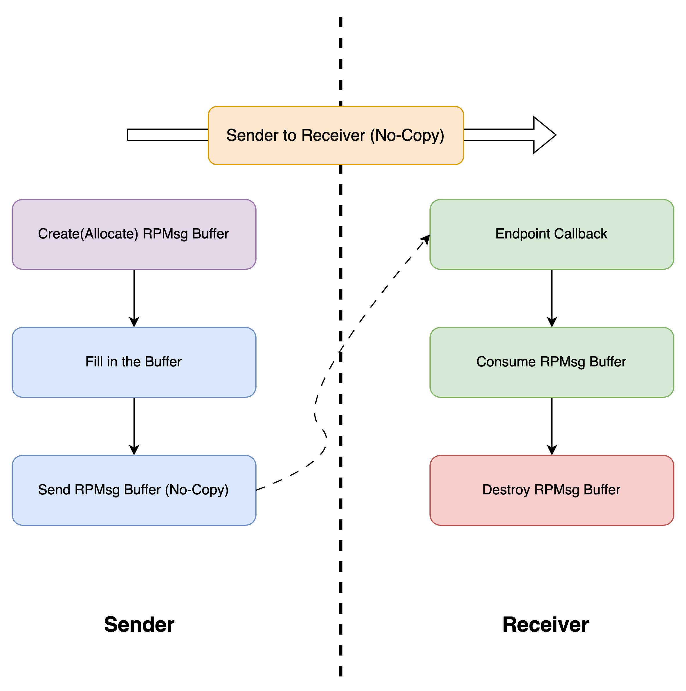
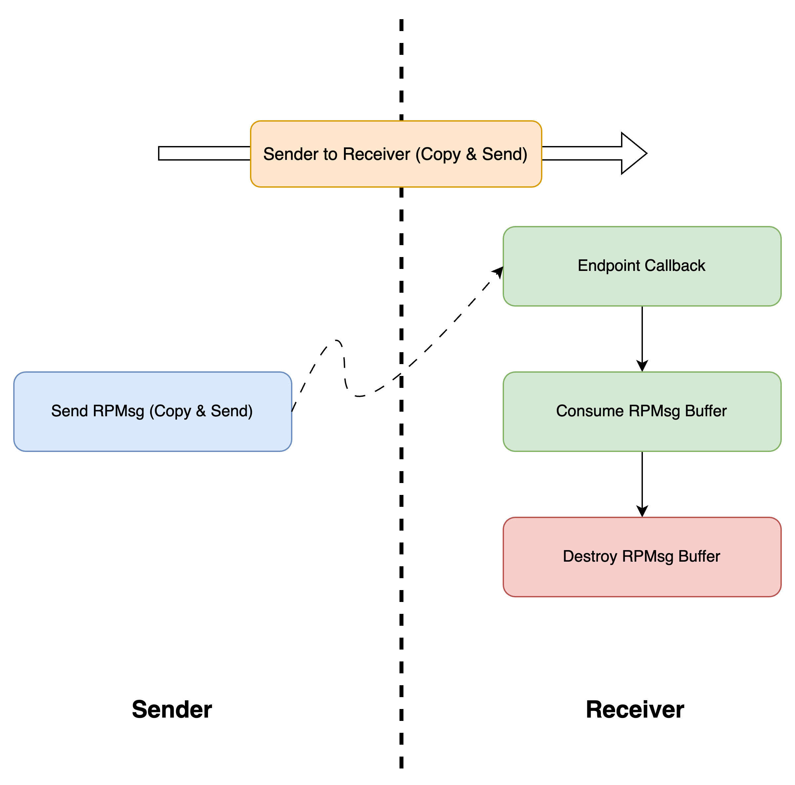

# RPMsg (Transport Layer)

## Overview

This layer provides **bidirectional end-to-end** communication and data exchange support in the framework. It features high efficiency and low memory footprint, which is able to multiplex the queue layer for various upper-level applications.

The RPMsg (Remote Processor Messaging) protocol is a critical component in modern embedded systems, particularly in multi-processor or multi-core architectures. It facilitates efficient inter-processor communication (IPC) by providing a standardized, low-overhead mechanism for message exchange between processors.

ESP-AMP's RPMsg implementation provides a communication framework supporting both FreeRTOS and bare-metal environments, which can be used to exchange data easily and efficiently between different cores.

Though in most cases, simply using RPMsg protocol(Transport Layer) is sufficient, you can still choose to use lower-level layers' API directly on demand, which gives additional flexibility and functionality to users.

## Design

Internally, this implementation uses two virtqueues which serve as TX and RX channel, correspondingly. On top of this, **Endpoint** feature is added which can multiplex the underlaying channels(link layer) to provide the abstract of a **Transport Layer**.

### Concept of Endpoint

In our case, endpoint is similar to the concept of `port` used in `TCP/IP` protocol. In the `TCP/IP` protocol, when you create an endpoint with specific `address`, it is as if a server is created and listening on a specific `port`, waiting for incoming connection. All data received from the other endpoint aiming to this `address` will be dispatched and sent to the corresponding endpoint.

Similarly, when sending data to the other core, an endpoint context must be provided along with the target `address`, which ensures that the message will go into the other core's corresponding endpoint and processed by its callback function.

The endpoint's callback function's type is defined as 

```c
int (*esp_amp_ept_cb_t)(void* msg_data, uint16_t data_len, uint16_t src_addr, void* rx_cb_data)
```

in `include/esp_amp_rpmsg.h`. among the parameter list, `rx_cb_data` is a data pointer saved in endpoint's data structure which can provide extra data/information in case it is necessary, and will be passed to the callback function everytime the function is invoked.

Note that the endpoint's callback function runs in `ISR context` if inter-core interrupts configured by ESP-AMP framework are enabled for `rpmsg` on the specific core. Consequently, only those ISR-safe APIs can be invoked inside the callback function, and any blocking or time-consuming things should be avoided.

### Workflow and Data Sending

#### 1. Send data without copy

Thanks to the nature of shared memory, sending data using rpmsg without copy is possible and recommended. To achive this, `esp_amp_rpmsg_create_msg(_from_isr)` should be firstly called by the **sender**, which will reserve one rpmsg buffer internally and return its pointer. After successfully getting the buffer pointer, in-place read/write can be performed. When everything is done, `esp_amp_rpmsg_send_nocopy(_from_isr)` can be invoked to send this excat rpmsg buffer to the other side. Note, these two APIs should always be called in pair. Otherwise, undefined behavior or buffer leak(similar to memory leak) can happen. The procedure is shown as the following figure:



For more details about corresponding APIs, please refer to the **Usage** section

#### 2. Send data with copy

Under some circumstances, copying and sending data in one function call is preferred. In this case, just invoke `esp_amp_rpmsg_send(_from_isr)` with data to be sent is enough. In other words, `esp_amp_rpmsg_send(_from_isr)` should be used standalone, WITHOUT calling `esp_amp_rpmsg_create_msg(_from_isr)`. Otherwise, buffer leak(similar to memory leak) can happen. The procedure is shown as the following figure:



For more details about corresponding APIs, please refer to the **Usage** section

## Usage

The usage of APIs is nearly the same between main-core and sub-core.

### Initialization

Before using the rpmsg framework APIs, initialization must be performed first. A data structure `esp_amp_rpmsg_dev_t` (defined in `src/esp_amp_rpmsg.h`) must be allocated in advance per side, whether statically or dynamically. Then, on main-core, `esp_amp_rpmsg_main_init` should be called before the sub-core can invoke `esp_amp_rpmsg_sub_init`. After both two sides' initailization  is done successfully, all rpmsg framework APIs can be used.

```c
/* Invoked on Main-Core */
int esp_amp_rpmsg_main_init(esp_amp_rpmsg_dev_t* rpmsg_dev, uint16_t queue_len, uint16_t queue_item_size, bool notify, bool poll);
/* Invoked on Sub-Core*/
int esp_amp_rpmsg_sub_init(esp_amp_rpmsg_dev_t* rpmsg_dev, bool notify, bool poll);
```

If you set `poll` to `false`(which means interrupt mechanism will be used on the setting core), the `notify` parameter MUST BE set to `true` **on the other core**, vice versa.

Besides, `esp_amp_rpmsg_intr_enable` **SHOULD BE** mannually invoked after initialization on the core where interrupt mechanism is used.

### Create Endpoint

Endpoint can be dynamically created/deleted/rebound on the specific core. However, all endpoint APIs shown below MUST NOT be invoked from `ISR context`:

```c
esp_amp_rpmsg_ept_t* esp_amp_rpmsg_create_ept(esp_amp_rpmsg_dev_t* rpmsg_device, uint16_t ept_addr, esp_amp_ept_cb_t ept_rx_cb, void* ept_rx_cb_data, esp_amp_rpmsg_ept_t* ept_ctx);
```

Create an endpoint with specific `ept_addr` and callback function(`ept_rx_cb`). `ept_rx_cb_data` will be saved in this endpoint's data structure and passed to the callback function when invoked. `ept_ctx` should be statically or dynamically allocated in advance. This API will return the same pointer as `ept_ctx` passed in if successful.

```c
esp_amp_rpmsg_ept_t* esp_amp_rpmsg_del_ept(esp_amp_rpmsg_dev_t* rpmsg_device, uint16_t ept_addr);
```

Delete an endpoint with specific address. This API will return `NULL` if the endpoint with corresponding `ept_addr` doesn't exist. If successful, the pointer to the deleted endpoint data structure will be returned, which can be freed or re-used later.

```c
esp_amp_rpmsg_ept_t* esp_amp_rpmsg_rebind_ept(esp_amp_rpmsg_dev_t* rpmsg_device, uint16_t ept_addr, esp_amp_ept_cb_t ept_rx_cb, void* ept_rx_cb_data);
```

Rebind an existing endpoint(specified using `ept_addr`) to different callback function(`ept_rx_cb`) and `ept_rx_cb_data`. This API will return `NULL` if the endpoint with corresponding `ept_addr` doesn't exist. If successful, the pointer to the modified endpoint data structure will be returned.

```c
esp_amp_rpmsg_ept_t* esp_amp_rpmsg_search_ept(esp_amp_rpmsg_dev_t* rpmsg_device, uint16_t ept_addr);
```

Search for an endpoint specified with `ept_addr`. This API will return `NULL` if the endpoint with corresponding `ept_addr` doesn't exist. If successful, the pointer to the endpoint will be returned.

### Send Data

#### 1. Send data without copy

 To achive this, the following API should be firstly called by the **sender**, which will reserve one rpmsg buffer internally and return its pointer:

```c
/* For task/BM context */
void* esp_amp_rpmsg_create_msg(esp_amp_rpmsg_dev_t* rpmsg_dev, uint32_t nbytes, uint16_t flags);
/* For ISR context */
void* esp_amp_rpmsg_create_msg_from_isr(esp_amp_rpmsg_dev_t* rpmsg_dev, uint32_t nbytes, uint16_t flags);
```

After successfully getting the buffer pointer, in-place read/write can be performed. When everything is done, the following API should be invoked to send this excat rpmsg buffer to the other side:

```c
/* For task/BM context */
int esp_amp_rpmsg_send_nocopy(esp_amp_rpmsg_dev_t* rpmsg_dev, esp_amp_rpmsg_ept_t* ept, uint16_t dst_addr, void* data, uint16_t data_len);
/* For ISR context */
int esp_amp_rpmsg_send_nocopy_from_isr(esp_amp_rpmsg_dev_t* rpmsg_dev, esp_amp_rpmsg_ept_t* ept, uint16_t dst_addr, void* data, uint16_t data_len);
```

The procedure is shown in the **Design** section.

#### 2. Send data with copy

In this case, just invoke the following API with data to be sent is enough:

```c
/* For task/BM context */
int esp_amp_rpmsg_send(esp_amp_rpmsg_dev_t* rpmsg_dev, esp_amp_rpmsg_ept_t* ept, uint16_t dst_addr, void* data, uint16_t data_len);
/* For ISR context */
int esp_amp_rpmsg_send_from_isr(esp_amp_rpmsg_dev_t* rpmsg_dev, esp_amp_rpmsg_ept_t* ept, uint16_t dst_addr, void* data, uint16_t data_len);
```

Note, `esp_amp_rpmsg_send(_from_isr)` should be used standalone, WITHOUT calling `esp_amp_rpmsg_create_msg(_from_isr)`. Otherwise, buffer leak(similar to memory leak) can happen. The procedure is shown in the **Design** section.

### Receive and consume data

The corresponding endpoint's callback function on the receiver side will be automatically invoked(by polling or interrupt handler) when the sender successfully sends the rpmsg. A pointer to the rpmsg data buffer will be provided to the callback function for reading/writing data. After finishing using the data buffer completely, the following API **MUST BE** called on this rpmsg buffer. Otherwise, buffer leak(similar to memory leak) can happen:

```c
/* For task/BM context */
int esp_amp_rpmsg_destroy(esp_amp_rpmsg_dev_t* rpmsg_dev, void* msg_data);
/* For ISR context */
int esp_amp_rpmsg_destroy_from_isr(esp_amp_rpmsg_dev_t* rpmsg_dev, void* msg_data);
```

**Note, `esp_amp_rpmsg_destroy(_from_isr)` MUST BE called on the receiver side after completely finishing using. Invoking this API on sender side or accessing the destroyed buffer can lead to UNDEFINED BEHAVIOR!**

### Deal with Buffer Overflow

The buffer overflow will happen whenever the size of data to be sent(including rpmsg header) is larger than the `queue_item_size` when performing the initialization. When this happens, `esp_amp_rpmsg_create_msg(_from_isr)` will return `NULL` pointer (i.e. refuse to allocate the rpmsg buffer whose size is expected to be larger than the maximum settings), `esp_amp_rpmsg_send_nocopy(_from_isr)` will return `-1` (i.e. refuse to send this rpmsg), `esp_amp_rpmsg_send(_from_isr)` will return `-1` (i.e. refuse to copy and send this rpmsg). In such case, the user should manage to split the data into several smaller pieces(packets) and then send them one by one. 

**Note: User should guarantee BOTH of or NONE of `esp_amp_rpmsg_create_msg(_from_isr)` and `esp_amp_rpmsg_send_nocopy(_from_isr)` succeed. Otherwise, buffer leak(similar to memory leak) can happen. To achive this, there are mainly three approaches: 1. make the size allocating(creating) the rpmsg larger or equal to the size sending the data; 2. re-send a special small message using the same rpmsg buffer which can be identified by the other side when `esp_amp_rpmsg_create_msg(_from_isr)` succeeds while `esp_amp_rpmsg_send_nocopy(_from_isr)` fails; 3. use `esp_amp_rpmsg_send(_from_isr)`**

## Application Examples

* [rpmsg_send_recv](../examples/rpmsg_send_recv/): demonstrates how maincore and subcore send data to each other using rpmsg.
